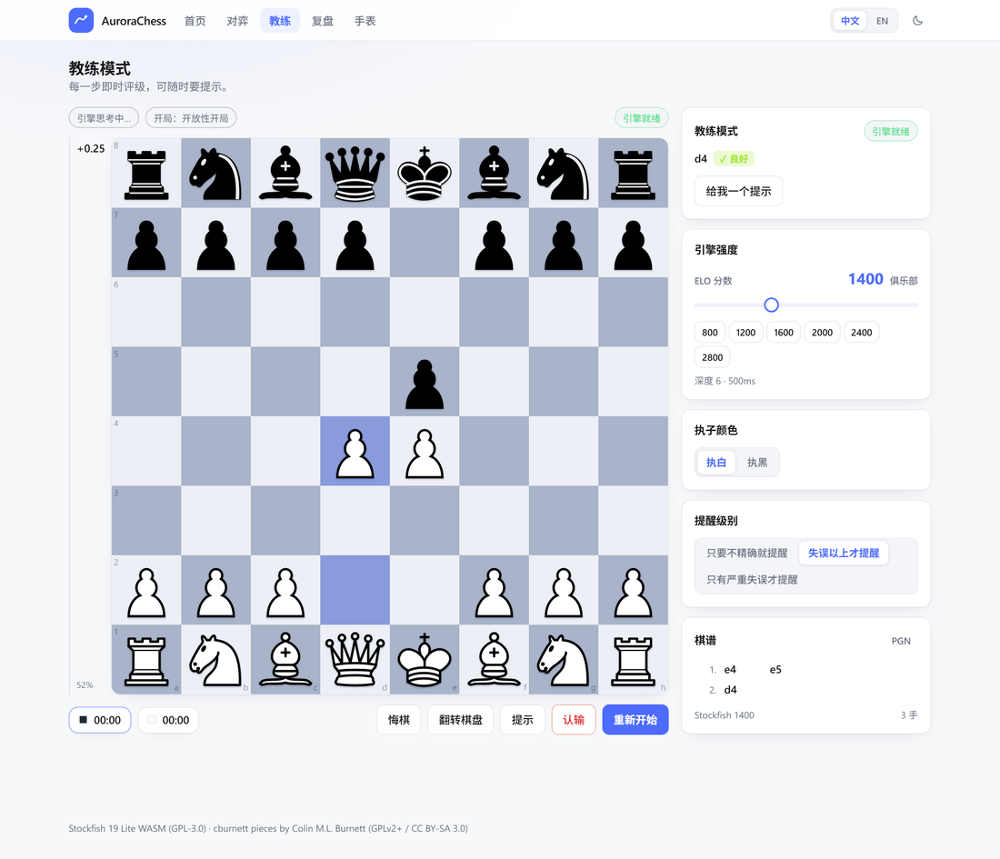
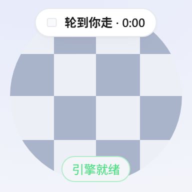
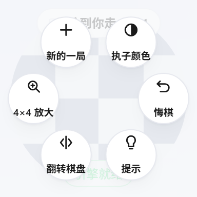
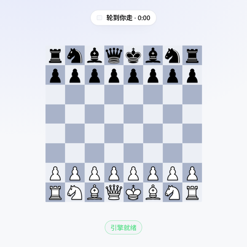

# AuroraChess

一个跑在 **Vercel** 上的国际象棋应用：**能与强度可调（ELO）的引擎对弈**、每步即时评级、可复盘、可要提示，并且同时适配 **手机 / 网页 / 智能手表（圆形小屏）**。

界面为 **DeepSeek 风格**（品牌蓝 `#4D6BFE`、浅色优先、白卡片 + 细边框 + 圆角），棋盘使用 **lichess 的 cburnett 棋组**。

引擎完全跑在浏览器里（Stockfish 19 Lite WASM，约 1.7 MB），**无后端、无 API Key、可离线**。



在 192×192 圆形手表视口下（同一套代码，自动切换布局）：

| 对局（默认 4×4 放大） | 径向菜单 | 整盘 8×8 |
| --- | --- | --- |
|  |  |  |

---

## 界面与棋子

| 项目 | 说明 |
| --- | --- |
| 视觉语言 | DeepSeek 风格：单一品牌蓝 `#4D6BFE`、浅色优先（默认浅色，深色为近黑）、12px 圆角、发丝边框、扁平填充、无渐变堆叠；**界面不含任何 emoji**，所有图标为内联 SVG |
| 棋子 | 默认 **lichess cburnett 棋组**（Colin M.L. Burnett），由 `scripts/setup-pieces.mjs` 从 `lichess-org/lila` 原样取回并提交到 `public/piece/cburnett/`，共 12 个 SVG、约 8 KB |
| 棋子备选 | 内置「几何棋子」自绘棋组（可切换），见 `components/board/PieceArt.tsx` |
| 棋盘配色 | 三套可选：**深寻蓝**（默认，中性冷灰棋盘 + 蓝色高亮）、**经典木色**（lichess 棕，cburnett 原始配色）、**冰川灰** |
| 高亮 | 最后一步 / 选中 / 合法点 / 将军 / 提示箭头全部走 CSS 变量，随棋盘配色切换；木色棋盘自动用回 lichess 的绿色高亮 |
| 文案原则 | 只保留功能标签、评级与数值，不做文字讲解 |

```bash
npm run pieces:setup     # 重新拉取 lichess 棋子（已提交，通常无需执行）
npm run engine:setup     # 重新拷贝 Stockfish WASM（同上）
```

## 功能

| 模式 | 说明 |
| --- | --- |
| **与引擎对弈** `/play` | 拖拽或点选落子；ELO 从 600 到 3000 无级调节；引擎带"拟人化"选着模型（见下文）；悔棋、提示、翻转、认输、PGN 导出、时钟 |
| **教练模式** `/coach` | 每一步给出**着法评级**（最佳/优秀/良好/谱招/唯一着法/不精确/失误/严重失误）；高于阈值的失误会**打断并暂停引擎应手**，可一键悔棋重走；可随时要**提示**（棋盘箭头 + 推荐着法） |
| **复盘分析** `/review` | 整盘棋逐着评分、双方准确率、失误统计、一键跳到问题手；支持粘贴/导出 PGN |
| **手表模式** `/watch` | 为圆形小屏设计：默认 4×4 放大棋盘，可切 2×2（超大点击目标）与 8×8 整盘视图（按圆内接正方形 1/√2 缩放，**整盘完整可见**）；点选两步落子、径向菜单与径向升变环、省电模式 |

其他：浅色/深色/跟随系统主题、中英双语、棋子与棋盘配色可切换、设置与棋谱本地持久化、无 emoji 的纯图标界面、`prefers-reduced-motion` 支持。

---

## 快速开始

```bash
npm install                 # 安装依赖（会自动跳过 postinstall 脚本）
npm run engine:setup        # 把 Stockfish WASM 从 node_modules 拷进 public/engine
npm run dev                 # http://localhost:3000
```

生产构建与部署：

```bash
npm run typecheck           # tsc --noEmit
npm test                    # vitest 单元测试
npm run engine:smoke        # 真实启动 WASM 引擎跑一遍 UCI（11 项检查）
npm run build               # next build
npm start                   # 本地跑生产构建
```

> `NEXT_SKIP_TYPECHECK=1 npm run build` 可跳过 Next 自带的类型检查步骤（它需要派生
> 子进程，某些受限环境不允许）。Vercel 上保持默认，即照常做类型检查。

### 质量门禁与验证结果

```bash
npm run typecheck   # tsc --noEmit                         → 0 errors
npm test            # vitest（8 个文件）                    → 88 passed
npm run engine:smoke# 启动 vendored WASM 跑真 UCI           → 11/11 通过
npm run build       # next build（6 条路由静态预渲染）        → 通过
npm start &         # 本地起生产服务
node scripts/browser-e2e.mjs http://127.0.0.1:3000
                    # 无头 Edge 真实浏览器端到端              → 33/33 通过
```

`scripts/browser-e2e.mjs` 只用 Node 内置的 `fetch`/`WebSocket`（无需 Playwright），
通过 DevTools 协议驱动本机 Edge/Chrome，验证单测覆盖不到的部分：

| 检查 | 内容 |
| --- | --- |
| 引擎资源 | `/engine/stockfish.wasm` 以 1 787 571 字节正确下发 |
| 引擎 Worker | 在真实浏览器里加载 `/engine/stockfish.js`、完成 `uciok`/`readyok`、跑到深度 8、返回 `bestmove` 且 MultiPV ≥ 2 |
| 棋子资源 | 棋盘上正好 32 个 `` 且**全部加载成功**（`naturalWidth > 0`），`/piece/cburnett/wK.svg` 返回 200 |
| 提示 | 点击「提示」后棋盘上出现推荐着法箭头（这条曾经是坏的：回调闭包漏了依赖，永远提前返回） |
| 无 emoji | 五个页面渲染出的文本里都不含 `Extended_Pictographic` 字符 |
| 对弈闭环 | 在 `/play` 上用真实指针事件点选 `e2→e4` 落子，引擎应手，棋谱出现 `e4 d6` |
| 教练 | 在 `/coach` 走一步后，面板给出一行评级（如 `d4 良好`）且不含解释文字 |
| 复盘 | 在 `/review` 载入上一局并跑完整盘分析，产出准确率统计 |
| 手表 | 模拟 192×192 圆屏：进入手表布局、隐藏导航、整屏适配、默认 4×4（每格 43px）、径向菜单 6 个控件且每个 ≥48px 不越界；切到整盘 8×8 时棋盘完整落在圆内（无裁剪） |

截图产物在 `.cache/e2e/`，仓库内的 `docs/screenshots/`（首页、对弈、教练、复盘、手表 192/454）是压缩后的界面截图。

### 部署到 Vercel

1. 把仓库推到 GitHub，在 Vercel 里 **Import Project**。
2. Framework 会被识别为 **Next.js**，构建命令 `next build`、输出目录默认即可，**不需要任何环境变量**。
3. 引擎资源已随仓库提交（`public/engine/stockfish.js` + `stockfish.wasm`），构建时无需联网下载引擎。
4. `next.config.ts` 里的 `headers()` 会给 `/engine/*` 加上一年期不可变缓存与正确的
   `application/wasm` MIME（本地 `next start` 已验证响应头）。
5. 部署完成后可打开 `/engine-selftest.html` 自检：页面会直接加载 Worker 跑一次 UCI 搜索并打印结果。

---

## 引擎强度是怎么调的

难度不是简单地把 Stockfish 调弱，而是**三层叠加**（参考 lichess 的做法，见 `docs/reference/lichess-notes.md`）：

1. **UCI 限强**：`UCI_LimitStrength` + `UCI_Elo`（本引擎实测范围 **1320–3190**）。
   低于 1320 时改用 `Skill Level`（0–20）。
2. **搜索预算**：随 ELO 插值 `depth` 与 `movetime`（600 分 ≈ 深度 1 / 200 ms，3000 分 ≈ 深度 30 / 2500 ms）。
3. **选着过滤器**（关键）：引擎用 MultiPV 返回多条候选，再用
   - `cplTarget`：从 N(均值, 标准差) 抽一个"目标损失分值"，用 sigmoid 给每条候选打分，
   - `moveDecay`：按权重排序后用 `decay^i` 加权随机挑选，

   于是低段位会像人一样"偶尔看漏"，而不是每一步都精确地摆烂。低段位还会先走
   内置开局库（`src/lib/coach/openings.ts`）的谱招，避免开局乱走。

手表端额外把预算压到 `depth ≤ 6` / `movetime ≤ 600ms`，并在页面不可见时暂停动画。

引擎不可用（老浏览器、资源被拦、内存不足）时会自动降级到内置的简易对手
（`src/lib/engine/fallback.ts`），界面永不卡死。

> 说明：启发式的「为什么」解释引擎（`src/lib/coach/findings.ts`、`probe.ts` —— 送子／叉子／
> 牵制／王安全／兵形）仍然保留并有 22 项单测，但按当前设计**不在界面上展示**：界面只给评级
> 与提示。需要时可在 `useGameController` 里重新接回。

---

## 目录结构

```
src/
  app/                      Next.js App Router
    layout.tsx  page.tsx    外壳 + 首页（模式入口、设置）
    play/ coach/ review/ watch/    四个模式页面
    globals.css             设计令牌、棋盘、圆形手表布局
  components/
    board/                  Board（拖拽/点选、高亮、箭头、升变）+ SVG 棋子
    game/                   GameScreen、教练面板、评估条、棋谱、时钟、ELO 滑杆
    watch/                  圆形舞台 + 可缩放棋盘 + 径向菜单
    ui/                     面板、标签、进度条等原语
  lib/
    chess/                  AuroraGame（chess.js 封装）、类型、棋子元数据
    engine/                 UCI 解析、Worker 客户端、ELO→参数映射、评估数学、React Provider、降级对手
    coach/                  开局库、局面探测（送子/叉子/牵制/王安全/兵形）、教练发现项
    game/                   控制器 Hook（对弈+教练流程）、复盘分析、PV 渲染
    store/                  设置（主题/语言/ELO…）与 localStorage 封装
    i18n/                   中英字典与插值
    hooks/                  手表判定、视口、可见性、减少动画
  generated/                engine-manifest.json（由脚本生成）
public/engine/              引擎与许可证（GPL-3.0）
scripts/                    setup-engine.mjs（拷贝引擎）、engine-smoke.mjs（真机 UCI 自检）
docs/                       开发计划、架构、lichess 与手表调研笔记
```

架构与数据流见 [`docs/ARCHITECTURE.md`](docs/ARCHITECTURE.md)，开发步骤与状态见
[`docs/DEVELOPMENT_PLAN.md`](docs/DEVELOPMENT_PLAN.md)。

---

## 手表（圆形屏）适配要点

调研结论见 [`docs/reference/watch-ui-notes.md`](docs/reference/watch-ui-notes.md)，实现遵循：

- **不做形状媒体查询**：`@media (shape: round)`、`device-radius` 等在所有浏览器都未实现；
  改为几何方案：`--d: min(100vw,100vh)`，圆形舞台 `clip-path: circle(50%)`，内容按直径 5.2% 内缩。
- **8×8 棋盘在手表上不可用**（192 CSS px 视口下每格约 17 px，远低于 48 px 点击下限）：
  默认 **4×4 放大窗口**（约 35–40 px/格），并自动把窗口平移到你选中/刚走的格子。
- **只用点选落子**：先点起点再点终点；升变用半径 `0.34·d` 的径向四选一环；没有键盘输入。
- 顶部状态条可点开**径向菜单**（悔棋/提示/翻转/缩放/新局/换边），避免在玻璃上堆一堆按钮。

---

## 许可与致谢

- 引擎：**Stockfish 19 Lite WASM**（`stockfish` npm 包，GPL-3.0）。
  `public/engine/LICENSE-stockfish.txt` 随资源分发；Stockfish 版权归其作者所有。
- 棋子：**cburnett** 棋组，作者 **Colin M.L. Burnett**，取自
  [lichess-org/lila](https://github.com/lichess-org/lila/tree/master/public/piece/cburnett)，
  许可 **GPLv2+ / CC BY-SA 3.0**，原样分发；见 `public/piece/cburnett/LICENSE.txt`。
- 规则与 PGN：**chess.js**（MIT）。
- 强度模型、胜率公式（`2/(1+e^{-0.00368208·cp})−1`）、失误分级阈值（0.1/0.2/0.3 胜率跌幅）、
  棋盘配色等参考自 **lichess**（AGPL-3.0）的公开实现与文档，本项目仅借鉴其算法与数值，
  未复制其代码；调研出处逐条列在 `docs/reference/lichess-notes.md`。
- 界面视觉参考 DeepSeek 的公开产品风格（配色/圆角/排版），logo 为项目自绘，未使用其商标素材。
